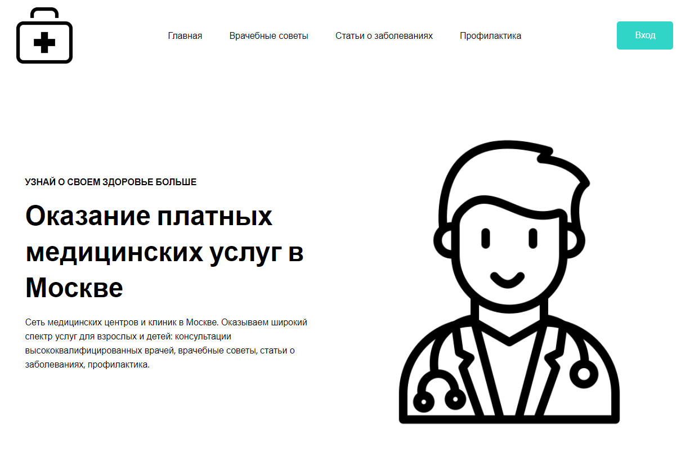
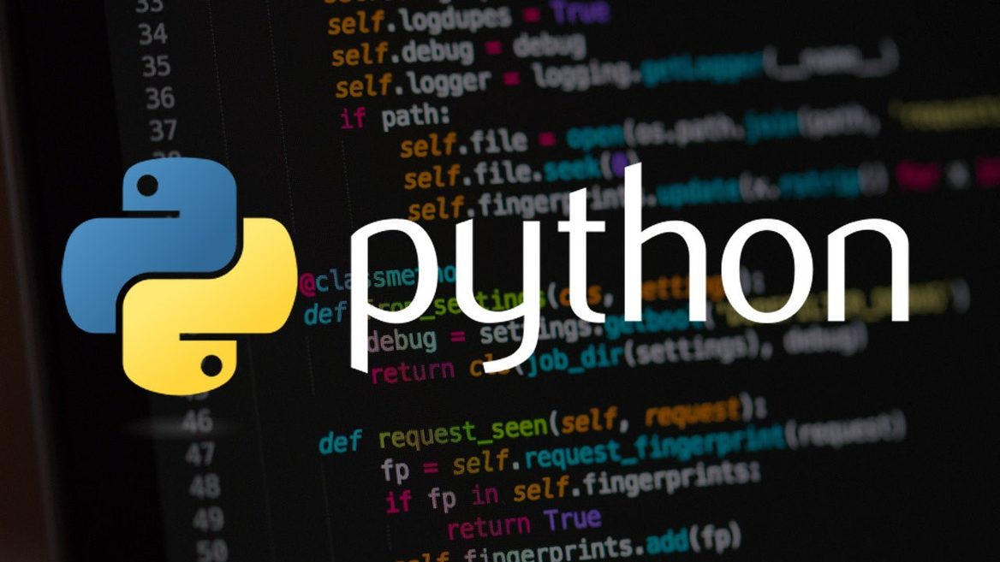

    
    Разработка сайта для оказания  платных медицинских услуг
  

 
📖Описание

Мой проект — это веб-сайт, предоставляющий платные медицинские услуги.  
Он предназначен для облегчения доступа пациентов к различным медицинским  
услугам и информации. Сайт предлагает пользователям возможность  
 авторизоваться, чтобы управлять своими данными, записываться на приемы,  
 просматривать медицинскую историю и получать персональные рекомендации.  
 Сайт также предоставляет удобный интерфейс для взаимодействия с  
 медицинскими специалистами и поиска необходимых услуг. Проект  
 улучшает качество и доступность медицинских услуг для пользователей.

  
🚀Инструменты  
Для запуска моего проекта понадобиться:  
Python (3.12.2)     
Фреймворк Flask-SQLAlchemy    
Фреймворк APScheduler    

 

🔧Установка  
Для запуска моего проекта понадобиться:  
· Python - устанавливаем на официальном сайте последнюю версию для  
вашей операционной системы.  
Фреймворки устанавливаем при помощи командой строки (cmd).  
В командой строке пишем:  
· pip install flask flask-sqlalchemy  
Данная команда установит сам Flask и его дополнение SQLAlchemy  
· pip install apscheduler  
APScheduler будет установлен вместе с необходимыми зависимостями.

 
🔎Использование  
 Как только пользователь открыл мой сайт, он попадает на главную  
 страницу. Можно продолжить листать ее либо перейти по другим   
 страницам при помощи верхнего меню. Также в меню можно найти   
 кнопку входа которая при нажатии перекинет на страницу входа в аккаунт.  
  Если аккаунта нет, то при нажатии "Регистрация", пользователь попадет  
   на страницу регистрации и при ее успехе его перекинет обратно на страницу  
    входа. При успешном входе пользователя вернет на главную страницу уже   
    авторизованным в его аккаунт.

